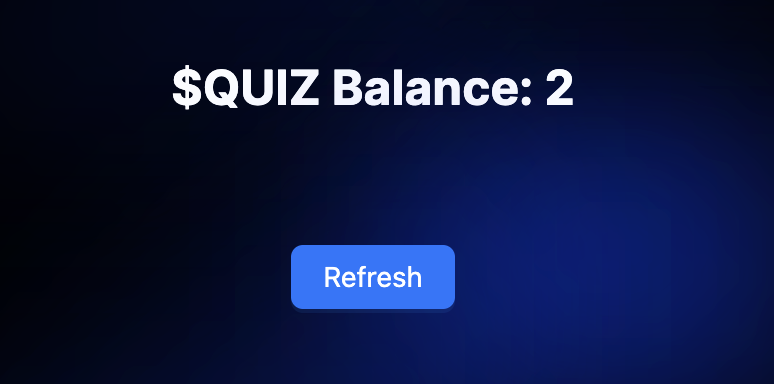

## Getting Started

First, install all packages:

```bash
yarn install
# or
npm install
```

Second, run the development server:

```bash
yarn dev
# or
npm run dev
```

Open [http://localhost:3000](http://localhost:3000) with your browser to see the result.

## Docs

- [Next.js Documentation](https://nextjs.org/docs) - Next.js.
- [TypeScript Documentation](https://www.typescriptlang.org/) - TypeScript.
- [Web3.js Documentation](https://web3js.readthedocs.io/en/v1.8.2/) - Web3.js.
- [Ant Design Documentation](https://ant.design/) - Ant Design.
- [MobX State Tree Documentation](https://mobx-state-tree.js.org/intro/welcome) - MobX State Tree.

## Project

<p align="center">


</p>
<p align="center">


</p>
<p align="center">


</p>
<p align="center">


</p>
<p align="center">


</p>
